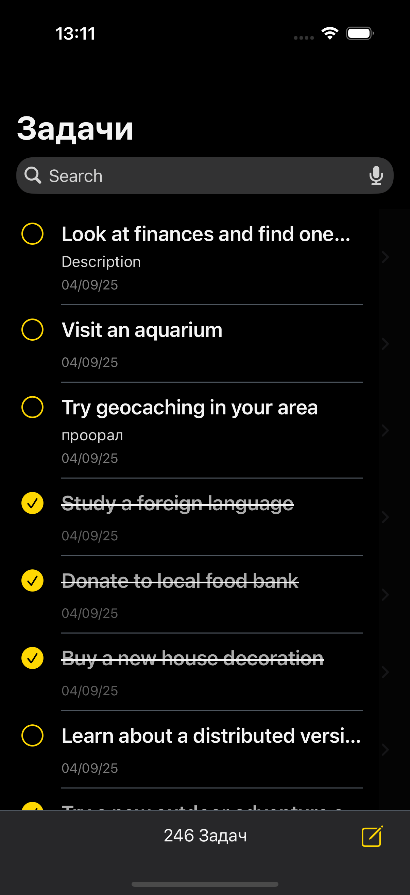
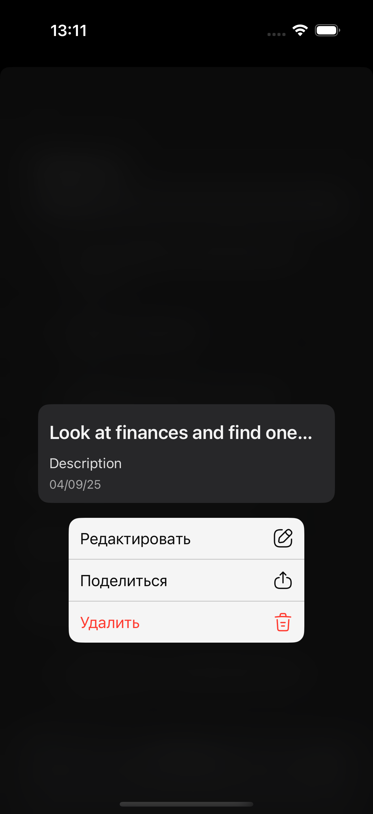
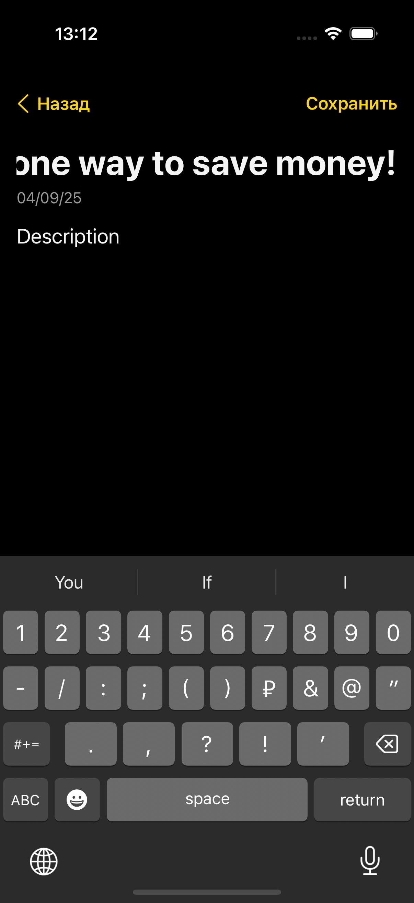

# ToDoList(тестовое)

Todo с локальным хранением и экраном деталей. Тёмная тема, программный UI, без сторибордов для экранов.

## Стек
- UI: UIKit, Auto Layout (code)
- Архитектура: VIPER
- Данные: Core Data (`CDToDo`)
- Сеть: URLSession, JSONDecoder
- Тесты: XCTest
- Язык/OS: Swift 5, iOS 15+

## Первый запуск (seed)
Если хранилище пустое и `seededOnce == false`, интерактор загружает `https://dummyjson.com/todos?limit=0`, сохраняет в Core Data и отображает список. 
Флаг хранится в `UserDefaults`.

## Архитектура
VIPER-модуль:
- View: `ToDoListViewController`
- Presenter: `ToDoListPresenter`
- Interactor: `ToDoListInteractor`
- Router: `ToDoListRouter`
- Entity(доменные): `ToDoEntity`
- Data: `ToDoRepository` (CoreData), `ToDosAPIClient`

## Функции
- Список задач, done/undo, зачёркнутый заголовок при `isDone`
- Поиск по заголовку и описанию
- Детали: просмотр, редактирование, удаление, поделиться
- Редактор: создание/правка, кнопка «Сохранить» активна только при изменениях
- Счётчик задач на нижней панели

## Тесты
- API: `ToDosAPIClientTests` (успех, HTTP-ошибка)  
- Repository: `ToDoRepositoryTests`, `ToDoRepositoryReplaceAllTests` (in-memory CoreData)  
- Presenter: `ToDoListPresenterTests` (load/map/display, routing, forwarding, loading/error)  
- UI smoke: `ToDoListUITests*` (запуск)
  
## Скриншоты
| Список | Функции | Редактор |
|---|---|---|
|  |  |  |

## Решения
- **ID:** в Core Data — `Int64` (тип модели), в домене — `Int`; конвертация в репозитории  
- **Потоки:** Core Data через `viewContext.perform {}`, обновления UI — на Main  
- **Сортировка:** централизована в `fetchAll()` по `createdAt` (новые сверху)  
- **Поиск:** пустой запрос → `fetchAll()`

## Как проверить seed вручную
Удалить приложение с симулятора и запустить снова
(сбросит CoreData и `UserDefaults.seededOnce`).
